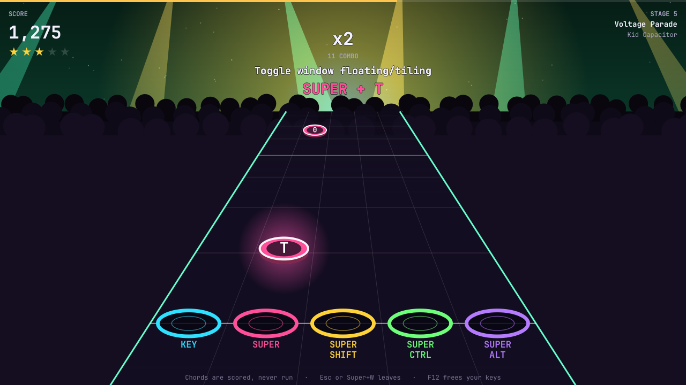

# Omarchy Gym

Rhythm-game keybinding workouts for [Omarchy](https://omarchy.org/) Quattro,
built on the stage, highway, and songs of Rockstar Hero.



Gym is a **normal tiled window**. Gems roll down a five lane highway toward
the strike line while a rock song plays. Press the chord on a gem as it
reaches the line. Gym never runs the real Hyprland or Omarchy action.

## How it plays

- **Lanes are modifiers**: `KEY` (no Super), `SUPER`, `SUPER SHIFT`,
  `SUPER CTRL`, and `SUPER ALT`. The gem shows the key, so lane plus gem is
  the chord. A chord with Shift and Ctrl sits in the Ctrl lane, and the gem
  adds `⇧`.
- **Timing grades**: Perfect, Great, and Good, worth 100, 75, and 50 points.
  A late or wrong chord is a miss.
- **Combo multiplier**: every 10 hits in a row adds one, up to x4.
- **Stars**: up to five per stage, from the share of notes hit and how
  cleanly. Three stars unlock the next stage.
- **Stages**: the chart follows the **Learn → Keybindings** order. It starts
  with the first 3 playable chords, then expands to 5, 10, 20, 40, and so on.
  Notes speed up and come closer together as stages rise.
- **Songs**: each stage plays one of Rockstar Hero's three songs (Neon
  Backroads, Voltage Parade, Dragon Freeway). Every note lands on a guitar
  note or a beat you can hear.

Each time Gym opens, it reads the current `omarchy menu keybindings --print`
output. `catalog.json` and `keybindings-print.txt` preserve a bundled snapshot
of stock Omarchy bindings; `GymLogic.js` applies the documented filters before
chart generation and uses the snapshot only if the command is unavailable,
does not finish within 3 seconds, or produces no playable rows.

Mouse binds, hardware (`XF86*`) keys, and Gym's `Super+W` close control are
excluded from scoring. See `plugin/sd.gym/DROPS.md`.

## Requirements and safety

- Omarchy Quattro with the Quickshell shell and Hyprland.
- Qt Multimedia (`qt6-multimedia`) for music. Omarchy's `flea` and `omacut`
  already pull it in. Without it, Gym plays silent.
- A user-configured `omarchy-gym` Hyprland submap; see
  `extra/omarchy-gym-submap.lua` (Lua config) or
  `extra/omarchy-gym-submap.conf` (hyprlang config).
- No sudo is required.
- Gym has no setup script, system unit, network access, or external runtime
  dependency. It only uses tools that ship with Omarchy.
- Gym writes progress only to
  `~/.local/state/omarchy/gym-progress.json`.
- Gym invokes `hyprctl` only to enter and leave its temporary submap. It
  holds the submap only while the Gym window has keyboard focus.
- The optional menu extension must be merged manually; Gym does not overwrite
  user configuration.

## Install

```sh
omarchy plugin add https://github.com/stevederico/omarchy-gym.git --enable
```

Open it from the launcher by searching **Gym**, or run:

```sh
omarchy-shell shell summon io.github.stevederico.omarchy-gym
```

Local checkout (copy the repository root, not a symlink):

```sh
PLUGIN_ID="io.github.stevederico.omarchy-gym"
PLUGIN_DIR="$HOME/.config/omarchy/plugins/$PLUGIN_ID"
mkdir -p "$PLUGIN_DIR"
cp -a ~/Projects/omarchy-gym/manifest.json \
  ~/Projects/omarchy-gym/plugin \
  ~/Projects/omarchy-gym/README.md \
  ~/Projects/omarchy-gym/LICENSE \
  "$PLUGIN_DIR/"
omarchy plugin validate "$PLUGIN_DIR"
omarchy plugin enable "$PLUGIN_ID"
```

## Optional integrations

To add a **Learn → Gym** menu row, merge the `learn.gym` object from
`extra/omarchy-menu-gym.jsonc` into your existing
`~/.config/omarchy/extensions/omarchy-menu.jsonc`. Do not replace that file.

To add an application-launcher entry:

```sh
cp extra/sd.gym.desktop ~/.local/share/applications/
```

To make Super chords reach Gym instead of Hyprland, merge one submap block
into your Hyprland bindings source:

- Lua config (Omarchy Quattro default): merge `extra/omarchy-gym-submap.lua`
  into `~/.config/hypr/bindings.lua`.
- hyprlang config: merge `extra/omarchy-gym-submap.conf` into
  `bindings.conf`.

Do not replace `bindings.lua` or `bindings.conf`. Leave all other chords
unbound in the submap so they are not dispatched. The Lua block also adds a
key listener that forwards each press made in the submap to Gym over shell
IPC, because Super chords may not reach a normal window; Gym scores a press
once even when both paths report it. The hyprlang block cannot do this, so
there Gym scores only the chords its window receives.

`Super+W` and bare Escape close Gym. F12 leaves the submap even if
omarchy-shell is not running.

## Remove

```sh
PLUGIN_ID="io.github.stevederico.omarchy-gym"
omarchy-shell shell hide "$PLUGIN_ID"
omarchy plugin disable "$PLUGIN_ID"
omarchy plugin remove "$PLUGIN_ID"
```

If installed, manually remove the optional menu object, desktop file, and
`omarchy-gym` submap block from your user configuration.

## Development checks

```sh
node --test tests/test_gym.js
```

On an Omarchy installation, also validate the root plugin:

```sh
PLUGIN_ID="io.github.stevederico.omarchy-gym"
PLUGIN_DIR="$HOME/.config/omarchy/plugins/$PLUGIN_ID"
omarchy plugin validate "$PLUGIN_DIR"
qmllint -I "$OMARCHY_PATH/shell" "$PLUGIN_DIR/plugin/sd.gym/run/Gym.qml"
```

If `qmllint` is not on your `PATH`, use `/usr/lib/qt6/bin/qmllint`. It exits 0
and reports `import` and `unqualified` warnings for the shell's `qs.Commons`
and `qs.Ui` singletons; the first-party Omarchy plugins report the same.

The tests exercise the same `plugin/sd.gym/run/GymLogic.js` module used by the
overlay and parse the bundled `plugin/sd.gym/keybindings-print.txt` fixture.

To rebuild that fixture, `catalog.json`, the baked list in `GymLogic.js`, and
`DROPS.md` from stock Omarchy bindings (never your own):

```sh
tools/regen-stock-keybindings.sh
```

The songs in `plugin/sd.gym/songs/` are rendered from a Rockstar Hero
checkout with its own WebAudio synth. To render them again (needs that
checkout with `node_modules`, `ffmpeg`, and a Chromium based browser):

```sh
ROCKSTAR_HERO_DIR=~/Projects/rockstar-hero tools/render-songs.sh
```

`run/Stage.js` is a port of Rockstar Hero's Canvas 2D renderer to Qt's
canvas; `run/GymLogic.js` holds the rules and is what the tests drive.

## Credits

The songs, stage art, highway, and scoring rules come from Rockstar Hero by
the same author, also MIT. Songs and bands are original and fictional.

## License

MIT. See [LICENSE](LICENSE).
